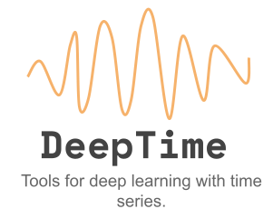

<div align='center'>
    
</div>

<h1 align='center'>DeepTime</h1>

<div align='center'>
    
    
    
</div>

<p align='center'>
    <a href='#about'>About</a> •
    <a href='#install'>Installing</a> •
    <a href=''>Using and Docs</a> •
    <a href=''>Contributing</a> •
    <a href=''>License</a> •
    <a href=''>Authors</a>
</p>

---

<h2 id='about' align='center'>About</h2>

<p align='center'>
DeepTime is a set of tools and models written based on the <a href='https://pytorch.org/'>PyTorch</a> framework and standards that aims to facilitate the use and development of models, other tools and projects that make use of deep learning techniques for supervised, semi-supervised and unsupervised learning tasks involving time series.
</p>

---

<h2 id='install' align='center'>Installing</h2>


In the near future it will be possible to install the library from the python package manager, pip. Until then we can install directly from the git repository or from the locally downloaded project.

To install from the git repository just run the following command in the terminal:

```bash
pip install git+https://github.com/jose-gilberto/deeptime
```

To install from a local repository you need to first download the repository from git, so first you will run the command to clone the repository:

```bash
git clone https://github.com/jose-gilberto/deeptime
```

Navigate to cloned project folder:

```bash
cd deeptime
```

And only then run the library's local installer.

```bash
pip install -e .
```

---

<h2 id='docs' align='center'>Using and Docs</h2>

Still in progress. Sorry about that :)

---

<h2 id='contrib' align='center'>Contributing</h2>

To contribute, just create a fork and use the project's [commit pattern](https://www.conventionalcommits.org/en/v1.0.0/). Remember to use semantic versioning and detail the PR so that it can be reviewed easily, avoid creating very large PRs, if you are going to implement two new features or corrections try to separate the branches, this way it will be easier to evaluate the PRs of each one and , if it occurs, refuse only the functionality with a bug or implemented correctly, avoiding impacting on the other that may be correct.

All contributions are welcome, remember to add your name/email as a contributor, so the community will know who are responsible for maintaining the project.

The basis of the project is and will always be open-source to allow access to knowledge and facilitate the development of science. If you use it, evaluate whether it is possible to leave the project open-source and if so, you can reference it in the documentation as examples of projects that use deeptime, we will be happy with that :)

Ah, another thing, always try to follow the code of conduct, there are no bad doubts, only doubts that were not answered, treat the community with respect, after all it is always possible for an experienced person to learn from a beginner. The true sage is always learning.

---

<h2 id='license' align='center'>License</h2>

The current Project License follows the MIT license model, all references, contributions and due credits will be mentioned within the documentation directory (docs). There will be references to articles, theories, proposals, functions and tools used, as well as links, posts and books used in the creation of models, tools, dataset creators and other things used by the project.

---

<h2 id='authors' align='center'>Authors</h2>

Made with love and a bit of anger by:

- [José Gilberto B. de Medeiros Jr.](mailto:medeiros.gilberto.br@gmail.com)
